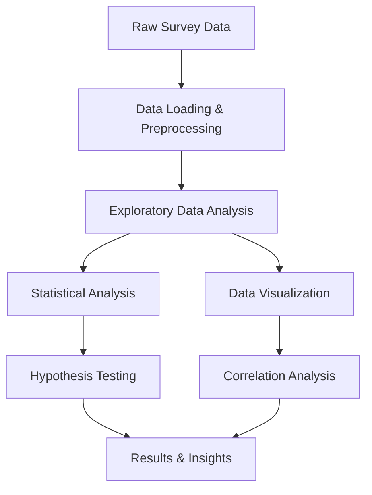

# Data Science Approaches to Analyzing Factors Associated with Depression

## Overview

This project demonstrates comprehensive data science methodologies for analyzing psychological survey data to identify factors associated with depression. Using a dataset of 39,773 participants, the project implements statistical analysis, visualization techniques, and hypothesis testing to understand demographic distributions and their relationship to depression prevalence.

## Key Features

- **Statistical Analysis**: Comprehensive descriptive statistics including mean, median, mode, and standard deviation
- **Data Visualization**: Interactive charts and heatmaps using Matplotlib for pattern identification  
- **Hypothesis Testing**: Chi-squared tests and t-tests for statistical significance validation
- **Correlation Analysis**: Cramer's V coefficient implementation for categorical variable relationships
- **Demographic Profiling**: Detailed analysis of age groups, gender, race, and other demographic factors

## Dataset Characteristics

- **39,773 participants** across diverse demographic groups
- **66 variables** including demographic information and depression indicators
- **Balanced distribution**: ~50.3% depressed vs ~49.7% non-depressed participants
- **Age groups**: 6 categories from "10 or younger" to "49 or older"
- **Gender distribution**: 76.35% Female, 22.10% Male, 1.39% Other

## Project Structure



## Notebooks

- **`1_workshop_day_1_basic.ipynb`**: Introduction to basic data science concepts
- **`2_depression_case_study.ipynb`**: Core depression analysis and case studies
- **`3_workshop_statistics.ipynb`**: Statistical methods implementation
- **`4_workshop_data.ipynb`**: Data preprocessing and cleaning techniques
- **`5_workshop_day_2_analysis.ipynb`**: Advanced analytical methods
- **`6_workshop_plots.ipynb`**: Comprehensive visualization suite

## Implementation Examples

### Data Loading and Preprocessing

```python
import gdown
import pandas as pd

# Download dataset from Google Drive
file_id = '1820cTzLBkyQLoJ9YngYu7KAw2gtPZF3O'
url = f'https://drive.google.com/uc?id={file_id}'
fileName = 'depression_data.csv'
gdown.download(url, fileName, quiet=False)

# Load into pandas DataFrame
data = pd.read_csv(fileName)
print(f"Dataset loaded: {data.shape[0]} participants, {data.shape[1]} features")
```

### Statistical Analysis

```python
# Calculate key statistical measures
mean_age = data['age'].mean()
median_age = data['age'].median()
std_age = data['age'].std()

# Generate comprehensive statistical summary
statistical_summary = data.describe()
print(statistical_summary)
```

### Depression Status Analysis

```python
# Count depression status distribution
depression_counts = data['depressed'].value_counts()
total_participants = len(data)

# Calculate percentages
num_depressed = depression_counts.get(1, 0)
num_not_depressed = depression_counts.get(0, 0)
percentage_depressed = (num_depressed / total_participants) * 100
percentage_not_depressed = (num_not_depressed / total_participants) * 100

print(f"Depressed participants: {percentage_depressed:.2f}%")
print(f"Not depressed participants: {percentage_not_depressed:.2f}%")
```

### Data Visualization

```python
import matplotlib.pyplot as plt

# Create depression status bar chart
labels = ['Not Depressed', 'Depressed']
counts = [depression_counts.get(0, 0), depression_counts.get(1, 0)]

plt.figure(figsize=(7, 4))
plt.barh(labels, counts, color=['green', 'red'])
plt.xlabel('Number of Participants')
plt.ylabel('Depression Status')
plt.title('Distribution of Participants by Depression Status')
plt.show()
```

### Demographic Analysis with Label Mapping

```python
# Gender distribution analysis
gender_counts = data['gender'].value_counts()
gender_labels = {1: 'Male', 2: 'Female', 3: 'Other'}

print("--- Gender Distribution ---")
for gender_code, count in gender_counts.items():
    label = gender_labels.get(gender_code, f'Unknown {gender_code}')
    percentage = (count / total_participants) * 100
    print(f"{label}: {count} ({percentage:.2f}%)")
```

### Age Group Visualization

```python
# Age group pie chart
age_group_labels = {
    1: '10 or younger', 2: '11-16 years', 3: '17-21 years',
    4: '22-35 years', 5: '36-48 years', 6: '49 or older'
}

age_group_counts = data['age_group'].value_counts().sort_index()
pie_labels = [age_group_labels[i] for i in age_group_counts.index]

plt.figure(figsize=(8, 8))
plt.pie(age_group_counts, labels=pie_labels, autopct='%1.1f%%', startangle=90)
plt.axis('equal')
plt.title('Age Group Distribution of Participants')
plt.show()
```

## Requirements

- Python 3.7+
- pandas
- matplotlib
- gdown
- numpy
- scipy (for statistical tests)

## Installation

```bash
pip install pandas matplotlib gdown numpy scipy
```

## Usage

1. Clone the repository
2. Install required dependencies
3. Run the notebooks in sequential order (1-6)
4. The dataset will be automatically downloaded when running the notebooks

## Key Findings

- Balanced representation across depression status (~50/50 split)
- Female participants significantly outnumber male participants (76% vs 22%)
- Age distribution varies across groups with specific concentrations in young adult categories
- Statistical significance found in various demographic-depression relationships

## Technologies Used

- **Python**: Primary programming language
- **Pandas**: Data manipulation and analysis
- **Matplotlib**: Data visualization and plotting
- **NumPy**: Numerical computations
- **SciPy**: Statistical testing
- **Jupyter Notebooks**: Interactive development environment

## License

This project is available for educational and research purposes.
