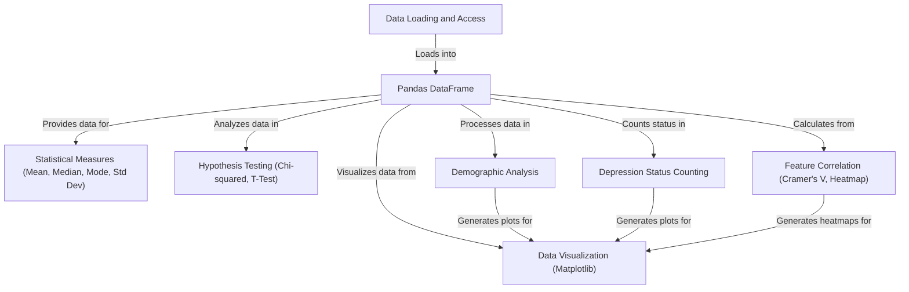
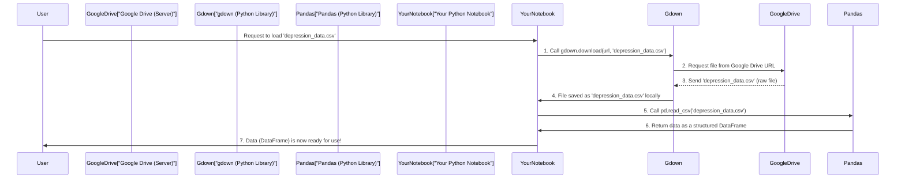
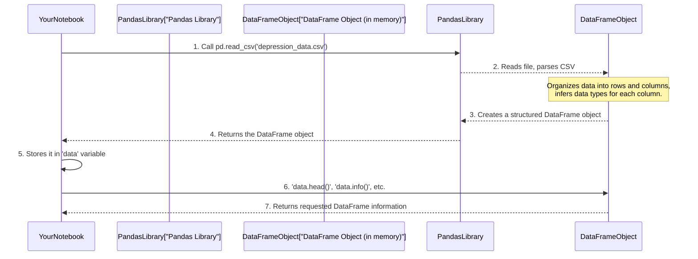
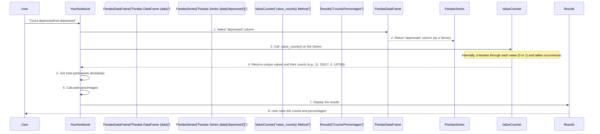
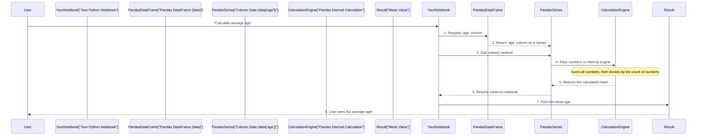

Data-Science-approaches-to-analyzing-and-elucidating-factors-associated-with-depression

This project uses data science techniques to *analyze factors associated with depression*.
It involves loading and storing survey data in a **Pandas DataFrame**, then applying various *statistical methods*
and *visualization tools* (like bar and pie charts, and heatmaps) to understand
demographic distributions and the prevalence of depression.
The project also uses *hypothesis testing* to identify statistically significant
relationships between different factors and depression status.


## Visual Overview



# Chapter 1: Data Loading and Access

Welcome to the exciting world of data science! Every great data adventure begins with one crucial first step: getting your data ready. Think of it like cooking – before you can whip up a delicious meal, you need to get your ingredients from the grocery store and unpack them in your kitchen. In our project, "Data Loading and Access" is exactly that: our **"data delivery service."**

This chapter will guide you through how we get our main ingredient, the `depression_data.csv` file, and prepare it for our analysis. By the end, you'll understand how to "order" your data, "receive" it, and take a first "peek inside" to make sure it's what you expected.

---

### Why is Data Loading Important?

Imagine you're trying to analyze factors related to depression, but you can't even get your hands on the dataset! That's the problem "Data Loading and Access" solves. It ensures our project can reliably fetch the data from its source (in this case, a Google Drive link) and transform it into a format that our tools (like Python's Pandas library) can easily understand and work with. It's the foundation for all the cool analysis we'll do later.

### Our First Ingredient: `depression_data.csv`

Our main goal in this chapter is to:
1.  **Download** the `depression_data.csv` file from a Google Drive link.
2.  **Load** this file into a usable "table" (called a DataFrame) using a tool called Pandas.
3.  **Take a quick look** at the data to ensure it's loaded correctly.

Let's dive in!

---

### Key Concepts: Our Data Delivery Crew

To achieve our goal, we'll meet two essential crew members:

1.  **`gdown`**: This is like our **"delivery driver"**. It's a special Python tool that knows how to download files directly from Google Drive links. We'll tell it where the file is (the Google Drive link) and what to name it on our computer.

2.  **`pandas`**: This is our **"unpacking service"**. Once `gdown` delivers the raw `.csv` file, `pandas` helps us open it up and organize it into a structured table, very similar to a spreadsheet. This organized table is called a **DataFrame**, which we'll explore in more detail in the next chapter: [Pandas DataFrame](02_pandas_dataframe_.md). For now, just think of it as a super-easy-to-use table!

---

### Step-by-Step: Getting Our Data

Let's see how `gdown` and `pandas` work together.

#### 1. Downloading the Data with `gdown`

First, we need to tell our "delivery driver" (`gdown`) where to pick up the data. Google Drive files have a unique "File ID."

```python
import gdown

# This is the unique ID for our depression data file on Google Drive
file_id = '1820cTzLBkyQLoJ9YngYu7KAw2gtPZF3O'
# We create a special link to download the file using its ID
url = f'https://drive.google.com/uc?id={file_id}'

# Now, we tell gdown to download the file and save it as 'depression_data.csv'
fileName = 'depression_data.csv'
gdown.download(url, fileName, quiet=False)
```
**Explanation:**
*   `import gdown`: This line brings the `gdown` tool into our Python environment.
*   `file_id = '...'`: This is a unique code for our data file on Google Drive.
*   `url = f'...'`: We construct a download link using the `file_id`.
*   `fileName = 'depression_data.csv'`: This is the name we want to give our file once it's downloaded.
*   `gdown.download(url, fileName, quiet=False)`: This command uses `gdown` to fetch the file from the `url` and save it with the `fileName`. `quiet=False` just means it will show us a progress bar during the download.

**What you'll see (Output description):**
When you run this, you'll see messages indicating that `gdown` is downloading the file, showing its progress, and finally, it will be saved as `depression_data.csv` in your current working directory (e.g., in Google Colab, it saves to `/content/`).

#### 2. Loading the Data with `pandas`

Once the `depression_data.csv` file is downloaded, our "unpacking service" (`pandas`) takes over.

```python
import pandas as pd

# This tells pandas where our file is located on our computer
file_path = 'depression_data.csv'

# This is the magic line! pandas reads the CSV file and organizes it into a table.
# We store this table in a variable called 'data'.
data = pd.read_csv(file_path)
```
**Explanation:**
*   `import pandas as pd`: This line imports the `pandas` library. We use `as pd` to give it a shorter nickname, `pd`, so we don't have to type `pandas` every time.
*   `file_path = 'depression_data.csv'`: We specify the name of the file we just downloaded.
*   `data = pd.read_csv(file_path)`: The `pd.read_csv()` function is `pandas'` way of reading files where data is separated by commas (CSV stands for Comma Separated Values). It takes the `file_path` as input and returns a DataFrame, which we store in the `data` variable. Now, `data` holds our organized spreadsheet-like information!

#### 3. Taking a First Peek: Accessing Our Data

Now that our data is loaded into the `data` DataFrame, let's "look inside" to see what it contains.

```python
# Display the first few rows of the dataset to get a quick overview
print("First few rows of the dataset:")
print(data.head())

# Display the total number of entries (rows) in the dataset
print("\nTotal number of participants (rows) in the dataset:", len(data))
```
**Explanation:**
*   `data.head()`: This is a very useful command that shows you the first 5 rows of your DataFrame. It's a quick way to check if your data loaded correctly and to see the column names and initial values.
*   `len(data)`: This function tells you how many entries (rows) are in your `data` DataFrame.

**What you'll see (Output description):**
You'll see a small table printed, showing the first 5 participants' data, along with all the column headers. Below that, you'll see a number indicating the total count of participants in our study.

---

### Under the Hood: How Data Gets Delivered and Unpacked

Let's visualize the "data delivery service" process:



**Step-by-step walkthrough:**
1.  **You ask your Notebook**: You, as the user, write code asking to load the data.
2.  **`gdown` picks up**: Your Python Notebook then tells `gdown` (our "delivery driver") to go get the file from the special Google Drive link.
3.  **`gdown` talks to Google Drive**: `gdown` sends a request to the Google Drive server where the file is stored.
4.  **Google Drive sends the file**: The Google Drive server responds by sending the raw `depression_data.csv` file back to `gdown`.
5.  **`gdown` saves the file**: `gdown` saves this raw file to your computer (or the Colab environment) with the name `depression_data.csv`.
6.  **`pandas` unpacks**: Next, your Notebook tells `pandas` (our "unpacking service") to read the `depression_data.csv` file that `gdown` just saved. `pandas` opens this file and converts its comma-separated values into a neat, organized table.
7.  **Data is ready**: `pandas` returns this organized table, which we call a DataFrame, and it's stored in a variable (e.g., `data`) in your Notebook. Now, you can easily work with the data!

**Where this code comes from:**
The code snippets used above are simplified versions of what you'll find in the project's Jupyter Notebook files. For example, in `6_workshop_plots.ipynb` and `5_workshop_day_2_analysis.ipynb`, you can see the actual `gdown` and `pandas.read_csv` calls:

*   **`6_workshop_plots.ipynb` - Cell 2 (partial snippet):**
    ```python
    import gdown
    # ... other gdown setup ...
    fileName = 'depression_data.csv'
    gdown.download(url, fileName, quiet=False)

    import pandas as pd
    file_path = 'depression_data.csv'
    data = pd.read_csv(file_path)
    ```
*   **`5_workshop_day_2_analysis.ipynb` - Cell 3 (partial snippet):**
    ```python
    import gdown
    # ... other gdown setup ...
    output = 'depression_data_cleaned.csv'
    gdown.download(url, output, quiet=False)
    ```
    *Note: In `5_workshop_day_2_analysis.ipynb`, the file is named `depression_data_cleaned.csv` and has a slightly different file_id, but the concept of data loading is identical.*

### Summary of Data Loading Steps:

| Step                                | Analogy                       | Tool/Function            | What it does                                                 |
| :---------------------------------- | :---------------------------- | :----------------------- | :----------------------------------------------------------- |
| 1. Get the Google Drive File ID     | Knowing the grocery store's address | Manual (or provided)     | Identifies the specific data file.                           |
| 2. Download the file                | "Delivery driver" picks up groceries | `gdown.download()`       | Fetches the raw `.csv` file from Google Drive.               |
| 3. Load into a DataFrame            | "Unpacking service" organizes groceries | `pd.read_csv()`          | Reads the `.csv` file and puts it into an easy-to-use table (DataFrame). |
| 4. Perform initial data access checks | "Quick peek" inside the grocery bags | `data.head()`, `len(data)` | Shows first few rows and total entries to confirm loading.    |

---

### Conclusion

You've successfully completed the first crucial step in any data science project: loading and accessing your data! You learned how to use `gdown` to download a dataset from Google Drive and `pandas` to load it into a structured DataFrame, making it ready for analysis. You also practiced taking a first look at the data to ensure everything is in place.

Now that our data is loaded and we've had a quick peek, it's time to learn more about the structure of this "usable table." In the [Pandas DataFrame](02_pandas_dataframe_.md) chapter, we'll dive deeper into what a DataFrame is and how to work with it effectively.

---
# Chapter 2: Pandas DataFrame

Welcome back, data adventurer! In [Chapter 1: Data Loading and Access](01_data_loading_and_access_.md), we successfully completed our "data delivery service" by downloading our `depression_data.csv` file and using the `pandas` library to "unpack" it. Remember how we said `pandas` organizes this data into a "super-easy-to-use table" called a DataFrame?

Well, in *this* chapter, we're going to dive deeper into that "table with superpowers." Understanding what a Pandas DataFrame is and how to work with it is like learning the secret language of your data. It's the central place where all our depression study information will live and where we'll perform most of our analysis.

---

### What Problem Does a DataFrame Solve?

Imagine you've just received a huge box of ingredients for a complex recipe (our `depression_data.csv`). If all the ingredients were just mixed together in a big pile, it would be impossible to sort, measure, or use them properly!

A Pandas DataFrame solves this problem by giving our data a **structured and organized home**. Instead of a chaotic pile, it arranges our "ingredients" (data points) into neat rows and columns, just like a well-organized spreadsheet in Excel or Google Sheets. This structure is incredibly powerful because it allows us to:

*   **See our data clearly**: What kind of information do we have? (e.g., age, gender, survey answers).
*   **Access specific parts easily**: Find all participants of a certain age, or look at only the survey answers.
*   **Perform calculations efficiently**: Calculate averages, count values, or spot patterns across different groups.

Our main goal in this chapter is to understand the basic structure of this "smart spreadsheet" so we can easily start exploring our `data` once it's loaded.

---

### Key Concept: The Pandas DataFrame

Let's break down what a DataFrame actually is:

#### 1. DataFrame: Your Smart Spreadsheet

Think of a **Pandas DataFrame** as a two-dimensional, size-mutable, tabular data structure with labeled axes (rows and columns). In simpler terms, it's a **table**.

*   **Rows**: Each row in the DataFrame usually represents a single **observation** or a single **participant** in our depression study. For example, all the information about Participant #1 would be in one row.
*   **Columns**: Each column represents a specific **feature** or type of information we collected. For instance, we might have columns for 'age', 'gender', 'country', and various survey answers like 'feeling_sad' or 'no_motivation'.

Each column can hold different types of data. For example, the 'age' column will hold numbers, while the 'gender' column might hold numbers (like 1 for male, 2 for female) or text. Pandas is smart enough to handle these different **data types** for us.

---

### How to Use a DataFrame: Getting to Know Your Data

In Chapter 1, we already loaded our `depression_data.csv` file into a variable named `data`. This `data` variable is now a Pandas DataFrame! Let's explore some basic ways to interact with it and understand its structure.

First, let's make sure we have Pandas imported, and then we'll load the data again for context.

```python
import pandas as pd # We use 'pd' as a short nickname for pandas

# Load the dataset (as we did in Chapter 1)
file_path = 'depression_data.csv'
data = pd.read_csv(file_path)
```
**Explanation:**
*   `import pandas as pd`: This line makes the Pandas library available to us and gives it the convenient nickname `pd`.
*   `data = pd.read_csv(file_path)`: This is the magic! The `pd.read_csv()` function reads our CSV file and converts it into a DataFrame, which is then stored in the `data` variable. Now, `data` is our "smart spreadsheet."

#### 1. Peeking at the First Few Rows (`.head()`)

We already used this in Chapter 1, but let's re-emphasize its importance for understanding DataFrame structure.

```python
# Display the first 5 rows of the DataFrame
print("First 5 rows of the dataset:")
print(data.head())
```
**Explanation:**
*   `data.head()`: This is a very common and useful method to quickly view the beginning of your DataFrame. By default, it shows the first 5 rows, giving you a glimpse of the column names and initial data values. This is great for a quick check that your data loaded as expected.

**Output description:**
You'll see a table showing the top 5 rows. The very first column (usually unnamed or indexed `0, 1, 2, 3, 4`) is the DataFrame's index (like row numbers in a spreadsheet). The top row contains the column names (like 'age', 'gender', 'depressed').

#### 2. Peeking at the Last Few Rows (`.tail()`)

Sometimes, you want to see the end of your data.

```python
# Display the last 3 rows of the DataFrame
print("\nLast 3 rows of the dataset:")
print(data.tail(3))
```
**Explanation:**
*   `data.tail(3)`: Similar to `.head()`, but it shows the last 3 rows. You can specify any number of rows you want to see inside the parentheses.

**Output description:**
You'll see a table showing the last 3 rows of your DataFrame, which helps confirm the end of your dataset.

#### 3. Getting a Summary of Data Types and Missing Values (`.info()`)

This is one of the most important commands to understand your DataFrame's health.

```python
# Display a summary of the DataFrame, including data types and non-null values
print("\nDataFrame Information:")
data.info()
```
**Explanation:**
*   `data.info()`: This method prints a concise summary of your DataFrame. For each column, it tells you:
    *   The **column name**.
    *   The **number of non-null (non-missing) values**.
    *   The **data type** (e.g., `int64` for whole numbers, `float64` for decimal numbers, `object` for text).

**Output description:**
You'll see a list of your columns, how many entries are *not empty* for each, and their respective data types. This is crucial for identifying columns with missing data or incorrect types.

#### 4. Checking the Dimensions (`.shape`)

To know how big our "smart spreadsheet" is, we use `.shape`.

```python
# Get the number of rows and columns
num_rows, num_columns = data.shape
print(f"\nDataFrame dimensions: {num_rows} rows, {num_columns} columns")
```
**Explanation:**
*   `data.shape`: This attribute returns a tuple (like a small list) indicating the dimensions of the DataFrame as `(number of rows, number of columns)`.

**Output description:**
You'll get a simple printout like "DataFrame dimensions: 39773 rows, 66 columns", telling you the exact size of your data.

#### 5. Listing All Column Names (`.columns`)

Sometimes you just need a list of all the column headers.

```python
# Get a list of all column names
print("\nColumn names in the DataFrame:")
print(data.columns)
```
**Explanation:**
*   `data.columns`: This attribute returns an index object containing all the column names of your DataFrame.

**Output description:**
You'll see a list of all the column names, which is handy when you're trying to select specific columns for analysis.

---

### Under the Hood: How DataFrames Work

Let's visualize how `pd.read_csv` transforms our raw `.csv` file into the organized DataFrame we just explored.



**Step-by-step walkthrough:**
1.  **You call `pd.read_csv()`**: In your Python Notebook, you execute the command to read the CSV file.
2.  **Pandas reads and parses**: The Pandas library takes the `depression_data.csv` file, opens it, and reads its contents. It understands that commas separate values.
3.  **Pandas creates the DataFrame object**: As it reads, Pandas intelligently organizes this raw, comma-separated data. It puts each line into a row and values between commas into different columns. It also tries to figure out if a column contains numbers, text, or dates (this is called "inferring data types").
4.  **DataFrame stored in `data`**: Pandas then creates a special object in your computer's memory – this is the DataFrame. It's not just a simple list of lists; it's a highly optimized structure.
5.  **You interact with `data`**: When you then call methods like `data.head()` or `data.info()`, you are asking the `data` DataFrame object to show you specific parts of its organized information.
6.  **Information is returned**: The DataFrame object efficiently retrieves and presents that information back to your Notebook.

**Why is it "highly optimized"?**
Underneath the friendly DataFrame interface, Pandas often uses another powerful Python library called NumPy. NumPy is incredibly fast at handling large amounts of numerical data. This means that even though a DataFrame looks simple and easy to use, it's built on a foundation designed for speed and efficiency, which is crucial when working with large datasets in data science.

---

### Summary of DataFrame Concepts and Operations:

| Concept/Operation  | Analogy                           | What it is / What it does                                                 | Code Example      |
| :----------------- | :-------------------------------- | :------------------------------------------------------------------------ | :---------------- |
| **DataFrame**      | Smart spreadsheet/Table           | The main way Pandas stores and organizes data in rows and columns.        | `data`            |
| **Rows**           | Individual entries/Records        | Each row is a single observation or participant.                          |                   |
| **Columns**        | Different types of information    | Each column is a specific feature (e.g., 'age', 'gender').              |                   |
| **Data Types**     | Type of info in a column          | Pandas automatically detects if a column holds numbers, text, etc.         |                   |
| `.head()`          | Quick peek (top)                  | Shows the first few rows of the DataFrame.                                | `data.head()`     |
| `.tail()`          | Quick peek (bottom)               | Shows the last few rows of the DataFrame.                                 | `data.tail(3)`    |
| `.info()`          | Data health check                 | Provides a summary of column data types and non-null (non-missing) counts.| `data.info()`     |
| `.shape`           | Dimensions                        | Returns the number of rows and columns as a tuple `(rows, columns)`.      | `data.shape`      |
| `.columns`         | Column headers list               | Returns a list of all column names.                                       | `data.columns`    |

---

### Conclusion

You've now got a solid grasp of what a Pandas DataFrame is and how to perform basic inspections to understand its contents. Think of the DataFrame as your well-organized kitchen cabinet, where all your ingredients are neatly stored and labeled, making them easy to find and use.

In the next chapter, we'll take this understanding and start visualizing our data using another powerful library: [Data Visualization (Matplotlib)](03_data_visualization__matplotlib__.md). We'll learn how to draw plots and charts directly from our DataFrame to discover patterns and insights in our depression data!

---
# Chapter 3: Data Visualization (Matplotlib)

Welcome back, data explorer! In [Chapter 2: Pandas DataFrame](02_pandas_dataframe_.md), we learned all about DataFrames – our "smart spreadsheet" for organizing our depression study data. We saw how neat rows and columns make our data understandable at a glance, but sometimes, a glance isn't enough to spot bigger trends or patterns.

---

### Why is Data Visualization Important?

Imagine trying to understand a complex story just by reading a long list of facts and figures. It would be hard to connect the dots! Data Visualization is like bringing that story to life with pictures. It's our project's **"artist" or "storyteller."** Instead of just looking at raw numbers in our `data` DataFrame, we can create visual representations like graphs and charts.

This helps us to:
*   **Quickly spot patterns**: Are more men or women affected by depression in our dataset?
*   **Understand distributions**: What age group has the most participants?
*   **Make comparisons easily**: How do different groups compare on certain factors?

Our main goal in this chapter is to understand how we can use the `Matplotlib` library to create simple plots directly from our `data` DataFrame, making complex information about depression easier to grasp.

---

### Key Concepts: Our Data Artist's Toolkit

To create our "data artwork," we'll be using `Matplotlib`, a powerful and popular Python library. Think of it as our complete art studio, providing all the tools we need to draw.

1.  **`matplotlib.pyplot` (often `plt`):** This is the main part of Matplotlib we'll use, like our **"drawing board."** We usually import it as `plt` for short. It provides a simple way to create plots.

2.  **`plt.figure()`:** This is like preparing our **"canvas."** It creates a new figure (the entire window or page that holds the plot). We can specify the `figsize` (size of the canvas) to make sure our artwork fits well.

3.  **`plt.barh()` and `plt.pie()`:** These are our **"brushes"** for drawing specific types of charts:
    *   `plt.barh()`: Draws **horizontal bar graphs**. Great for comparing quantities across different categories.
    *   `plt.pie()`: Draws **pie charts**. Excellent for showing parts of a whole (percentages).

4.  **`plt.xlabel()`, `plt.ylabel()`, `plt.title()`:** These are our **"labels and titles."** They help us clearly describe what our plot is showing on the X-axis, Y-axis, and the overall title of the plot.

5.  **`plt.show()`:** This is like the **"grand reveal."** It displays all the plots we've created. Without this, your code might run, but you won't actually *see* any pictures!

---

### How to Use Matplotlib: Drawing Insights from Our Data

Let's use some common scenarios from our `depression_data.csv` to see Matplotlib in action. We'll start by ensuring we have our `pandas` DataFrame (`data`) ready, as we loaded it in previous chapters.

```python
import pandas as pd # Our "unpacking service"
import matplotlib.pyplot as plt # Our "drawing board"

# Load the dataset (as we did in Chapter 1 & 2)
file_path = 'depression_data.csv'
data = pd.read_csv(file_path)
```
**Explanation:**
*   We `import pandas as pd` to work with DataFrames.
*   We `import matplotlib.pyplot as plt` to get our plotting tools.
*   The `data = pd.read_csv(file_path)` line ensures our `data` DataFrame is loaded and ready for visualization.

#### 1. Visualizing Depression Status: A Bar Chart

Let's find out how many participants in our dataset are `Depressed` (value 1) and `Not Depressed` (value 0). In [Chapter 4: Depression Status Counting](04_depression_status_counting_.md), we'll dive deeper into counting, but for now, we'll use a simple method.

```python
# Count occurrences of 0 and 1 in the 'depressed' column
# value_counts() is a handy Pandas function for this!
depression_counts = data['depressed'].value_counts()

# Prepare labels and counts for our plot
labels = ['Not Depressed', 'Depressed']
# We ensure the order matches our labels (0 then 1)
counts = [depression_counts.get(0, 0), depression_counts.get(1, 0)]

# Create our "canvas" (figure) with a specific size
plt.figure(figsize=(7, 4))

# Draw a horizontal bar chart
# plt.barh(y-axis labels, x-axis values)
plt.barh(labels, counts, color=['green', 'red'])

# Add labels and a title to make our plot clear
plt.xlabel('Number of Participants')
plt.ylabel('Depression Status')
plt.title('Distribution of Participants by Depression Status')

# Show our beautiful artwork!
plt.show()
```
**Explanation:**
*   `data['depressed'].value_counts()`: This counts how many times each unique value (0 or 1) appears in the 'depressed' column.
*   `labels` and `counts`: We prepare these lists so Matplotlib knows what text to put next to each bar and how long to make the bars.
*   `plt.figure(figsize=(7, 4))`: This creates a new empty drawing area (figure) that is 7 inches wide and 4 inches tall.
*   `plt.barh(labels, counts, color=['green', 'red'])`: This draws the horizontal bars. 'Not Depressed' will be green, and 'Depressed' will be red.
*   `plt.xlabel()`, `plt.ylabel()`, `plt.title()`: These add descriptive text to our chart.
*   `plt.show()`: This command displays the plot in your output.

**What you'll see (Output description):**
You'll see a horizontal bar chart. There will be two bars, one for 'Not Depressed' (likely green) and one for 'Depressed' (likely red). The length of each bar will represent the number of participants in that category, and the chart will have clear labels and a title.

#### 2. Visualizing Age Group Distribution: A Pie Chart

Our dataset has an 'age_group' column where numbers (1-6) represent different age brackets. Let's create a pie chart to see the percentage of participants in each age group.

```python
# Define the age groups and their corresponding labels
age_group_labels = {
    1: '10 or younger',
    2: '11-16 years',
    3: '17-21 years',
    4: '22-35 years',
    5: '36-48 years',
    6: '49 or older'
}

# Count the occurrences of each age group number
age_group_counts = data['age_group'].value_counts().sort_index()

# Map the numeric age group keys (1-6) to their descriptive labels
labels_for_pie = [age_group_labels[i] for i in age_group_counts.index]

# Create our "canvas"
plt.figure(figsize=(7, 7)) # Make it square for a nice circle pie chart

# Draw a pie chart
# autopct='%1.1f%%': This formats the percentage text shown on each slice
# startangle=140: Rotates the start of the first slice for better readability
plt.pie(
    age_group_counts,
    labels=labels_for_pie,
    autopct='%1.1f%%',
    startangle=140
)

# Ensure the pie chart is drawn as a perfect circle
plt.axis('equal')

# Add a title
plt.title('Age Group Distribution of Participants')

# Show our artwork!
plt.show()
```
**Explanation:**
*   `age_group_labels`: A dictionary to translate the numbers (1-6) from our data into more understandable text descriptions.
*   `data['age_group'].value_counts().sort_index()`: Counts occurrences of each age group and `sort_index()` keeps them in order (1, 2, 3...).
*   `labels_for_pie`: This list will contain the descriptive text for each slice of the pie chart.
*   `plt.pie()`: This function draws the pie chart.
    *   The first argument (`age_group_counts`) provides the size of each slice.
    *   `labels` provides the text for each slice.
    *   `autopct` shows the percentage on each slice.
    *   `startangle` rotates the chart so the first slice starts at a specific angle.
*   `plt.axis('equal')`: This is important for pie charts, as it ensures the plot is drawn as a circle, not an oval.

**What you'll see (Output description):**
You'll see a circular pie chart divided into different slices. Each slice represents an age group, and its size corresponds to the percentage of participants in that group. Each slice will also have its percentage displayed, and the entire chart will have a title.

---

### Under the Hood: Matplotlib's Drawing Process

Let's look at a simplified sequence of what happens when you ask Matplotlib to create and display a plot:

```mermaid
sequenceDiagram
    participant User
    participant YourNotebook["Your Python Notebook"]
    participant PandasDataFrame["Pandas DataFrame (data)"]
    participant MatplotlibLibrary["Matplotlib Library (plt)"]
    participant PlotObject["Plot Object (in memory)"]
    participant DisplayOutput["Display Output (e.g., Colab, Jupyter)"]

    User->>YourNotebook: Wants to see depression status bar chart
    YourNotebook->>PandasDataFrame: 1. data['depressed'].value_counts()
    PandasDataFrame-->>YourNotebook: 2. Returns counts (e.g., {0: 19756, 1: 20017})
    YourNotebook->>MatplotlibLibrary: 3. plt.figure(figsize=(7,4))
    MatplotlibLibrary-->>PlotObject: 4. Creates an empty plot container
    YourNotebook->>MatplotlibLibrary: 5. plt.barh(labels, counts, colors)
    MatplotlibLibrary->>PlotObject: 6. Draws bars, adds labels, calculates positions
    YourNotebook->>MatplotlibLibrary: 7. plt.xlabel(), plt.ylabel(), plt.title()
    MatplotlibLibrary->>PlotObject: 8. Adds text to the plot container
    YourNotebook->>MatplotlibLibrary: 9. plt.show()
    MatplotlibLibrary->>DisplayOutput: 10. Renders the plot as an image and shows it
    DisplayOutput-->>User: 11. User sees the bar chart!
```

**Step-by-step walkthrough:**
1.  **You ask your Notebook**: You write and run the Python code in your Notebook (e.g., Google Colab).
2.  **Pandas prepares data**: Your Notebook first asks the `data` DataFrame to count the values in the 'depressed' column.
3.  **Matplotlib sets up the canvas**: Your Notebook then tells `Matplotlib` (specifically `plt.figure()`) to prepare a new, empty space for drawing. This becomes our `PlotObject` in memory.
4.  **Matplotlib draws the elements**: Next, your Notebook sends commands like `plt.barh()`, `plt.xlabel()`, and `plt.title()` to Matplotlib. Matplotlib takes the data (labels, counts) and uses its internal rules to draw the bars, calculate their lengths, position labels, and format the title. All of this happens invisibly within the `PlotObject`.
5.  **Matplotlib displays the plot**: Finally, `plt.show()` tells Matplotlib to take the complete `PlotObject` (which now contains all the drawn elements) and render it as an image. This image is then sent to your Notebook's output area, so you can see the finished chart.

**Where this code comes from:**
The simplified code snippets we used are based on the actual project notebooks. For example, in `6_workshop_plots.ipynb`, you can see these exact Matplotlib calls being used to generate various visualizations.

---

### Summary of Data Visualization Concepts and Operations:

| Concept/Operation      | Analogy                                   | What it is / What it does                                                 | Code Example                                   |
| :--------------------- | :---------------------------------------- | :------------------------------------------------------------------------ | :--------------------------------------------- |
| `matplotlib.pyplot` (`plt`) | Your artist's drawing board/studio        | The main module for creating plots.                                     | `import matplotlib.pyplot as plt`              |
| `plt.figure()`         | Preparing your canvas                     | Creates a new figure (the container for your plot).                       | `plt.figure(figsize=(7, 4))`                   |
| `plt.barh()`           | Drawing horizontal bars                   | Creates a horizontal bar chart for comparing categories.                | `plt.barh(labels, counts, color='blue')`       |
| `plt.pie()`            | Drawing pie slices                        | Creates a pie chart to show parts of a whole (percentages).             | `plt.pie(sizes, labels=labels, autopct='%1.1f%%')` |
| `plt.xlabel()`, `plt.ylabel()` | Labeling axes                             | Adds labels to the X and Y axes of your plot.                           | `plt.xlabel('X-axis Name')`                    |
| `plt.title()`          | Naming your artwork                       | Adds a title to your entire plot.                                         | `plt.title('My Awesome Plot')`                 |
| `plt.show()`           | Unveiling your artwork                    | Displays the generated plot.                                            | `plt.show()`                                   |
| `value_counts()`       | Counting unique items                     | Pandas function to count occurrences of unique values in a column.      | `data['column'].value_counts()`                |

---

### Conclusion

You've now learned how to use Matplotlib to visualize your data! This is a crucial skill in data science, as it allows you to quickly transform raw numbers into understandable pictures, revealing patterns and insights that would be hard to spot otherwise. You can think of it as giving a voice to your data, letting it tell its own story visually.

Now that we can load, inspect, and visualize our data, we'll move on to a more focused analysis. In the next chapter, [Depression Status Counting](04_depression_status_counting_.md), we'll apply these skills to understand the core `depressed` column in our dataset in more detail.

---
# Chapter 4: Depression Status Counting

Welcome back, data explorer! In [Chapter 3: Data Visualization (Matplotlib)](03_data_visualization__matplotlib__.md), we unleashed our inner artist and learned how to draw insightful pictures from our `data` DataFrame. We even created a simple bar chart to *see* the distribution of participants with and without depression. Now, let's take a closer look at the actual numbers behind that visualization.

---

### Why is Depression Status Counting Important?

Imagine you're leading a study on depression, and the very first question everyone asks is: "How many of our participants are actually depressed?" This is a fundamental question that "Depression Status Counting" answers. Think of it like a **"tally counter"** for our main question: Is a participant depressed or not?

By systematically going through the 'depressed' column of our `data` DataFrame, we count how many entries indicate "depressed" (usually represented by 1) and how many indicate "not depressed" (usually 0). This simple count provides an immediate, essential overview of the balance between these two key groups in our study. It's the first step in understanding the prevalence of depression within our dataset, which then sets the stage for all our deeper analyses.

Our main goal in this chapter is to quickly and accurately find out:
1.  The **total number** of participants.
2.  The **number of depressed** participants.
3.  The **number of not depressed** participants.
4.  The **percentage** of each group.

---

### Key Concepts: Our Data Tally Crew

To efficiently perform this counting, we'll rely on our trusty `pandas` DataFrame (`data`) and a couple of its powerful, yet simple, tools:

1.  **`value_counts()`:** This is like our **"smart tally counter."** It's a special method that Pandas DataFrames (specifically, a single column, which Pandas calls a Series) have. When you use it on a column, it automatically goes through every entry in that column and counts how many times each unique value appears. For our 'depressed' column, it will tell us exactly how many 0s and how many 1s there are.

2.  **`len()`:** This is our **"total item checker."** This built-in Python function simply tells you the total number of items in a list, or in our case, the total number of rows (participants) in our `data` DataFrame. It's crucial for calculating percentages!

---

### How to Use Our Tally Crew: Getting the Counts

Let's put `value_counts()` and `len()` into action. First, we'll make sure our `data` DataFrame is loaded, as we've done in previous chapters.

```python
import pandas as pd # Our "unpacking service"

# Load the dataset (as we did in Chapter 1 & 2)
file_path = 'depression_data.csv'
data = pd.read_csv(file_path)
```
**Explanation:**
*   We `import pandas as pd` to have access to our DataFrame tools.
*   The `data = pd.read_csv(file_path)` line ensures our `data` DataFrame is loaded and ready for analysis.

#### 1. Counting Depression Status with `value_counts()`

Now, let's use our "smart tally counter" to get the numbers for 'depressed' and 'not depressed' participants.

```python
# Use .value_counts() on the 'depressed' column
depression_status_counts = data['depressed'].value_counts()

print("Counts of participants by Depression Status:")
print(depression_status_counts)
```
**Explanation:**
*   `data['depressed']`: This selects only the 'depressed' column from our `data` DataFrame.
*   `.value_counts()`: This method is then called on that specific column. It processes all the values (0s and 1s) and returns a new small table (a Pandas Series) showing each unique value and its count.
*   `print()`: We use `print()` to display the results.

**What you'll see (Output description):**
You'll see a simple output that looks something like this:
```
1    20017
0    19756
Name: depressed, dtype: int64
```
This tells us there are 20,017 participants with a 'depressed' status of 1 (depressed) and 19,756 participants with a 'depressed' status of 0 (not depressed). The order (1 then 0, or 0 then 1) might vary, but the numbers will be consistent.

#### 2. Calculating Percentages

With the counts in hand, let's find out what percentage of our participants fall into each category.

```python
# Get the total number of participants
total_participants = len(data)
print(f"\nTotal number of participants: {total_participants}")

# Retrieve the counts for 'depressed' (1) and 'not depressed' (0)
# .get() is used here to safely retrieve the value, returning 0 if the key isn't found
num_depressed = depression_status_counts.get(1, 0)
num_not_depressed = depression_status_counts.get(0, 0)

# Calculate percentages
percentage_depressed = (num_depressed / total_participants) * 100
percentage_not_depressed = (num_not_depressed / total_participants) * 100

print(f"Percentage of Depressed participants: {percentage_depressed:.2f}%")
print(f"Percentage of Not Depressed participants: {percentage_not_depressed:.2f}%")
```
**Explanation:**
*   `total_participants = len(data)`: This gets the total number of rows (participants) in our DataFrame.
*   `num_depressed = depression_status_counts.get(1, 0)`: We extract the count for value `1` (depressed) from our `depression_status_counts` result. `.get(1, 0)` is a safe way to do this; it tries to get the value for key `1`, but if `1` doesn't exist (which shouldn't happen here, but is good practice), it returns `0` instead of causing an error.
*   The percentage calculations are straightforward: (part / whole) * 100.
*   `:.2f%`: This is a formatting trick to display the number with two decimal places and a percent sign.

**What you'll see (Output description):**
You'll see the total number of participants, followed by the calculated percentages for both depressed and not depressed groups, similar to this:
```
Total number of participants: 39773
Percentage of Depressed participants: 50.33%
Percentage of Not Depressed participants: 49.67%
```
This gives us a clear understanding of the balance of our primary outcome in the dataset.

---

### Under the Hood: How Counting Works

Let's visualize the simplified process of counting the depression status:



**Step-by-step walkthrough:**
1.  **You ask your Notebook**: You, as the user, run the Python code to count the depression status.
2.  **Select the column**: Your Notebook first asks the `data` DataFrame to give it just the 'depressed' column.
3.  **Pandas provides Series**: Pandas returns this column as a special, single-column data structure called a Series.
4.  **`value_counts()` tallies**: Your Notebook then tells this Series to use its `.value_counts()` method. Internally, this method efficiently scans through all the `0`s and `1`s in the 'depressed' column, keeping a running tally for each.
5.  **Counts returned**: The `value_counts()` method then returns a new, small Series containing the unique values (0 and 1) and how many times each appeared.
6.  **Total and percentages**: Your Notebook then gets the total number of participants from the original `data` DataFrame using `len(data)` and performs simple division to calculate the percentages.
7.  **Results displayed**: Finally, your Notebook prints these clear, summarized results for you.

**Where this code comes from:**
The `value_counts()` method is a standard Pandas function that is widely used. You can see it in action in the project's `6_workshop_plots.ipynb` file (e.g., in the "Analysis 1" section) where it's used to prepare data for plotting.

---

### Summary of Depression Status Counting:

| Concept/Operation      | Analogy                | What it is / What it does                                                 | Code Example                                |
| :--------------------- | :--------------------- | :------------------------------------------------------------------------ | :------------------------------------------ |
| `data['column']`       | Selecting a specific ingredient | Extracts a single column (e.g., 'depressed') from the DataFrame.          | `data['depressed']`                         |
| `.value_counts()`      | Smart Tally Counter    | Counts occurrences of each unique value in a Series (a single column).    | `data['depressed'].value_counts()`          |
| `len(DataFrame)`       | Total Item Checker     | Returns the total number of rows (participants) in the DataFrame.         | `len(data)`                                 |
| Basic Arithmetic       | Simple Calculator      | Used to compute percentages or proportions.                               | `(count / total) * 100`                     |
| `.get(key, default)`   | Safe Value Retrieval   | Retrieves a count for a specific value, returning a default if not found. | `counts.get(1, 0)`                          |

---

### Conclusion

You've successfully learned how to use powerful Pandas tools to get a clear, numerical overview of your dataset's primary outcome: depression status. This fundamental counting skill is crucial for understanding your data and forms the basis for more complex analyses.

Now that we can easily count and understand the distribution of depression in our dataset, we're ready to start exploring other characteristics of our participants. In the next chapter, [Demographic Analysis](05_demographic_analysis_.md), we'll apply similar counting and visualization techniques to understand the makeup of our study population based on factors like age, gender, and marital status.

---
# Chapter 5: Demographic Analysis

Welcome back, data adventurer! In [Chapter 4: Depression Status Counting](04_depression_status_counting_.md), we became expert "tally counters" for our `depressed` column, understanding the basic distribution of depression in our dataset. Now, it's time to broaden our view and ask: **"Who are these participants?"**

---

### Why is Demographic Analysis Important?

Imagine you're trying to understand if a new medicine works for everyone. You wouldn't just look at if it worked; you'd also want to know *who* it worked for. Did it work better for younger people? Men or women? People from certain backgrounds?

Demographic analysis is exactly this for our data project. It's our project's **"population census taker."** It helps us understand the fundamental characteristics of the people (participants) in our study. By looking at things like their gender, race, marital status, and age groups, we can:

*   **Get a clear picture**: Who makes up our dataset? Is it mostly young adults, or is there a good mix of all ages?
*   **Identify key groups**: Are there many more females than males? Is one racial group heavily represented?
*   **Spot potential biases**: If our dataset only has participants from one age group, our findings might not apply to other age groups.
*   **Focus future analysis**: Knowing the demographics helps us decide which groups to examine more closely when we look for factors related to depression.

Our main goal in this chapter is to learn how to calculate and display the distribution of these basic participant characteristics using our `data` DataFrame, similar to how we counted depression status.

---

### Key Concepts: Our Population Census Toolkit

To perform demographic analysis, we'll build on tools you've already met and introduce one simple new idea:

1.  **`value_counts()`:** Our trusty **"smart tally counter"** from [Chapter 4](04_depression_status_counting_.md). We'll use it again on different demographic columns (like 'gender' or 'age_group') to quickly see how many participants fall into each category.

2.  **`data['column_name']`:** How we select a specific column from our DataFrame, like `data['gender']` to look at only the gender information.

3.  **Mapping Numeric Codes to Labels:** Many demographic columns in our dataset use numbers (like 1, 2, 3) to represent categories (like Male, Female, Other). We'll use a simple Python **dictionary** to translate these numbers into human-readable text labels. This makes our analysis results much clearer!

4.  **`matplotlib.pyplot` (`plt`):** Our **"drawing board"** from [Chapter 3](03_data_visualization__matplotlib__.md). We'll use it to create simple bar charts or pie charts to visualize these distributions, making them easy to understand at a glance.

---

### How to Perform Demographic Analysis: Getting to Know Our Participants

Let's start by loading our data, as always.

```python
import pandas as pd # Our "unpacking service"
import matplotlib.pyplot as plt # Our "drawing board" for visualizations

# Load the dataset (as we did in Chapter 1 & 2)
file_path = 'depression_data.csv' # Assuming this file is available after Chapter 1
data = pd.read_csv(file_path)

print("Data loaded successfully! First 5 rows:")
print(data.head())
```
**Explanation:**
*   We import `pandas` and `matplotlib.pyplot` (as `plt`).
*   We load `depression_data.csv` into our `data` DataFrame.
*   `data.head()` gives us a quick confirmation that the data is ready.

**What you'll see (Output description):**
You'll see a message confirming data loading and the first few rows of your DataFrame, similar to what you saw in previous chapters.

#### 1. Analyzing Gender Distribution

Let's look at the 'gender' column. In our dataset, gender is likely represented by numbers (e.g., 1 for Male, 2 for Female, 3 for Other). We want to count these and present them clearly.

```python
# 1. Count how many participants are in each gender category
gender_counts = data['gender'].value_counts()

# 2. Define a dictionary to map the numeric codes to clear labels
gender_labels = {
    1: 'Male',
    2: 'Female',
    3: 'Other'
}

print("\n--- Gender Distribution ---")
# 3. Print the counts using our labels
for gender_code, count in gender_counts.items():
    label = gender_labels.get(gender_code, f'Unknown Gender Code {gender_code}')
    print(f"Number of {label} participants: {count}")

# 4. Calculate and print percentages
total_participants = len(data)
for gender_code, count in gender_counts.items():
    label = gender_labels.get(gender_code, f'Unknown Gender Code {gender_code}')
    percentage = (count / total_participants) * 100
    print(f"Percentage of {label} participants: {percentage:.2f}%")
```
**Explanation:**
*   `data['gender'].value_counts()`: This gets the raw counts for each numeric gender code (e.g., 1, 2, 3).
*   `gender_labels`: This dictionary is crucial! It tells Python that when it sees a `1` in the 'gender' column, it means 'Male', a `2` means 'Female', and so on. This makes our output much more understandable.
*   The `for` loop then goes through each gender code and its count, uses the `gender_labels` dictionary to get the correct text label, and prints the result.
*   We also calculate and print the percentage for each group, making it easier to compare proportions.

**What you'll see (Output description):**
You'll see a clear printout showing how many participants are identified as Male, Female, or Other, along with their respective percentages in the dataset. For example:
```
--- Gender Distribution ---
Number of Female participants: 30365
Number of Male participants: 8789
Number of Other participants: 552
Percentage of Female participants: 76.35%
Percentage of Male participants: 22.10%
Percentage of Other participants: 1.39%
```

#### 2. Visualizing Gender Distribution with a Bar Chart

Now, let's use our visualization skills from [Chapter 3](03_data_visualization__matplotlib__.md) to make this even clearer.

```python
# Prepare labels and counts for plotting
plot_labels = [gender_labels.get(code, f'Unknown {code}') for code in gender_counts.index]
plot_counts = gender_counts.values

plt.figure(figsize=(8, 5)) # Create a canvas
plt.bar(plot_labels, plot_counts, color=['skyblue', 'salmon', 'lightgreen']) # Draw vertical bars

plt.xlabel('Gender Category') # Label the X-axis
plt.ylabel('Number of Participants') # Label the Y-axis
plt.title('Distribution of Participants by Gender') # Add a title
plt.xticks(rotation=45, ha='right') # Rotate labels if they overlap
plt.tight_layout() # Adjust layout to prevent labels from being cut off
plt.show() # Show the plot
```
**Explanation:**
*   We extract the `plot_labels` (Male, Female, Other) and `plot_counts` from our `gender_counts` and `gender_labels`.
*   `plt.bar()` creates a vertical bar chart.
*   `plt.xlabel()`, `plt.ylabel()`, `plt.title()` add descriptive text.
*   `plt.xticks(rotation=45, ha='right')` is a helpful trick for longer labels; it rotates them so they don't overlap.
*   `plt.tight_layout()` helps ensure everything fits nicely on the chart.

**What you'll see (Output description):**
A bar chart will appear, with one bar for each gender category (Male, Female, Other). The height of each bar will represent the number of participants, and the chart will have clear labels and a title. This immediately shows which gender group is largest.

#### 3. Analyzing Age Group Distribution

Our dataset also has an 'age_group' column, likely with numeric codes (1-6) representing different age ranges. Let's analyze this using a similar approach.

```python
# 1. Count occurrences of each age group
age_group_counts = data['age_group'].value_counts().sort_index()

# 2. Define a dictionary to map numeric age group codes to descriptive labels
age_group_labels = {
    1: '10 or younger',
    2: '11-16 years',
    3: '17-21 years',
    4: '22-35 years',
    5: '36-48 years',
    6: '49 or older'
}

print("\n--- Age Group Distribution ---")
# 3. Print the counts using our labels
for age_code, count in age_group_counts.items():
    label = age_group_labels.get(age_code, f'Unknown Age Group Code {age_code}')
    print(f"Number of participants aged {label}: {count}")

# 4. Calculate and print percentages
for age_code, count in age_group_counts.items():
    label = age_group_labels.get(age_code, f'Unknown Age Group Code {age_code}')
    percentage = (count / total_participants) * 100
    print(f"Percentage of participants aged {label}: {percentage:.2f}%")
```
**Explanation:**
*   `data['age_group'].value_counts().sort_index()`: We count the values, and `.sort_index()` ensures the age groups are presented in numerical order (1, 2, 3...) for better readability.
*   `age_group_labels`: Another dictionary for mapping numerical codes to descriptive age ranges.
*   The rest is similar to the gender analysis: looping through counts, mapping labels, and calculating percentages.

**What you'll see (Output description):**
A printout similar to the gender distribution, but showing the counts and percentages for each age group, from '10 or younger' to '49 or older'.

#### 4. Visualizing Age Group Distribution with a Pie Chart

Pie charts are great for showing parts of a whole, so let's use one for age groups.

```python
# Prepare labels and sizes for the pie chart
pie_labels = [age_group_labels.get(code, f'Unknown {code}') for code in age_group_counts.index]
pie_sizes = age_group_counts.values

plt.figure(figsize=(8, 8)) # Make the canvas square for a round pie
plt.pie(
    pie_sizes,
    labels=pie_labels,
    autopct='%1.1f%%', # Format percentages on slices
    startangle=90, # Start the first slice at the top
    wedgeprops={'edgecolor': 'black'} # Add a border to slices
)
plt.axis('equal') # Ensures the pie chart is circular
plt.title('Age Group Distribution of Participants')
plt.show()
```
**Explanation:**
*   `pie_labels` and `pie_sizes` are prepared from our age group analysis.
*   `plt.pie()` draws the pie chart.
    *   `autopct='%1.1f%%'` displays the percentage on each slice with one decimal place.
    *   `startangle=90` makes the first slice start from the top, which often looks nicer.
    *   `wedgeprops` adds a small black line around each slice for better distinction.
*   `plt.axis('equal')` ensures the chart is a perfect circle.

**What you'll see (Output description):**
A circular pie chart divided into slices, each representing an age group. Each slice will show its percentage, and the overall chart will have a title. This visualization makes it easy to compare the proportional size of each age group.

---

### Under the Hood: Demographic Census Process

Let's visualize how we perform a demographic analysis, focusing on the mapping and counting aspects:

```mermaid
sequenceDiagram
    participant User
    participant YourNotebook["Your Python Notebook"]
    participant PandasDataFrame["Pandas DataFrame (data)"]
    participant PandasSeries["Column (e.g., data['gender'])"]
    participant ValueCounter["value_counts() Method"]
    participant LabelDictionary["gender_labels (Dictionary)"]
    participant FinalReport["Printed/Plotted Results"]

    User->>YourNotebook: "Analyze Gender Distribution"
    YourNotebook->>PandasDataFrame: 1. Select 'gender' column
    PandasDataFrame-->>PandasSeries: 2. Return 'gender' column data
    YourNotebook->>ValueCounter: 3. Call .value_counts()
    Note over ValueCounter: Counts occurrences of 1s, 2s, 3s etc.
    ValueCounter-->>YourNotebook: 4. Returns counts (e.g., {1: 8789, 2: 30365, 3: 552})
    YourNotebook->>LabelDictionary: 5. Look up label for each code (e.g., 1 -> 'Male')
    LabelDictionary-->>YourNotebook: 6. Returns text label
    YourNotebook->>FinalReport: 7. Combine count and label for printing/plotting
    FinalReport-->>User: 8. User sees the gender distribution report & chart!
```

**Step-by-step walkthrough:**
1.  **You ask your Notebook**: You run the Python code to analyze a demographic feature like 'gender'.
2.  **Select the column**: Your Notebook tells the `data` DataFrame to give it just the 'gender' column.
3.  **Pandas provides the Series**: The DataFrame returns this column as a Pandas Series (a single column of data).
4.  **`value_counts()` tallies**: Your Notebook then calls the `.value_counts()` method on this Series. This method efficiently scans through all the numeric codes (1, 2, 3...) in the column and calculates how many times each one appears.
5.  **Counts returned**: The `value_counts()` method returns a small table (Series) showing each unique numeric code and its total count.
6.  **Labels applied**: Your Notebook then uses the `gender_labels` dictionary. For each numeric code and its count, it "looks up" the corresponding human-readable text (e.g., `1` becomes 'Male').
7.  **Results prepared**: This combined information (text label and count/percentage) is then formatted for printing or for plotting with Matplotlib.
8.  **Report displayed**: Finally, the clear, understandable demographic report (both text and chart) is shown to you.

**Where this code comes from:**
The techniques demonstrated here, especially using `.value_counts()` and custom dictionaries for mapping, are extensively used in `5_workshop_day_2_analysis.ipynb` within the section "Analyzing demographic information" to generate the detailed output for various demographic factors.

---

### Summary of Demographic Analysis Concepts:

| Concept/Operation      | Analogy                                   | What it is / What it does                                                 | Code Example                                |
| :--------------------- | :---------------------------------------- | :------------------------------------------------------------------------ | :------------------------------------------ |
| `data['column']`       | Targeting specific information            | Selects a single column (e.g., 'gender', 'age_group') from the DataFrame. | `data['gender']`                            |
| `.value_counts()`      | Smart Tally Counter (revisited)           | Counts occurrences of each unique value in a column.                    | `data['gender'].value_counts()`             |
| **Dictionary Mapping** | Translator / Codebook                     | A Python dictionary that stores key-value pairs (e.g., `1: 'Male'`) to translate numeric codes to text labels. | `gender_labels = {1: 'Male', ...}`          |
| Basic Arithmetic       | Percentage Calculator                     | Used to compute the proportion of each group relative to the total.     | `(count / total) * 100`                     |
| `matplotlib.pyplot` (`plt`) | Our Data Artist (revisited)               | Used to create visualizations like bar charts and pie charts from the counts. | `plt.bar(...)`, `plt.pie(...)`              |
| `.sort_index()`        | Organizing the counts                     | Sorts the results of `value_counts()` by the numeric code.              | `data['age_group'].value_counts().sort_index()` |

---

### Conclusion

You've successfully learned how to perform demographic analysis, which is vital for understanding the "who" behind your data! By combining `value_counts()` with thoughtful mapping of numeric codes to descriptive labels, and by visualizing the results with Matplotlib, you can now quickly grasp the composition of your study population based on characteristics like gender and age. This foundational understanding helps contextualize all further analyses.

Now that we know who our participants are, and how many are in each group, we're ready to dig deeper into the *numbers* within these groups. In the next chapter, [Statistical Measures (Mean, Median, Mode, Std Dev)](06_statistical_measures__mean__median__mode__std_dev__.md), we'll learn how to calculate key summary statistics to describe the central tendencies and spread of our data.

---
# Chapter 6: Statistical Measures (Mean, Median, Mode, Std Dev)

Welcome back, data adventurer! In [Chapter 5: Demographic Analysis](05_demographic_analysis_.md), we learned to identify *who* our participants are, examining characteristics like their gender and age groups. We used counting and visualization to understand the makeup of our study population. Now, let's take a closer look at the actual *numbers* within these groups and how we can describe them more precisely.

---

### Why are Statistical Measures Important?

Imagine you're at a party and someone asks, "What's the typical age of people here?" You wouldn't list every single person's age! Instead, you'd give a single number that summarizes the ages. This is exactly what statistical measures do: they are like our project's **"data summary reporters."**

These measures provide single numbers that give us a quick and powerful snapshot of a whole column of data. For our depression study, they help us answer questions like:
*   What's the **average age** of participants?
*   What's the **middle score** on a certain survey question?
*   What's the **most common number of children** participants have?
*   Are participants' ages all **very similar**, or are they **spread out** across many different values?

By using these "summary reporters," we can quickly understand the central characteristics and spread of our numerical data, which is crucial for identifying patterns and potential relationships with depression.

Our main goal in this chapter is to learn how to calculate and interpret the most common statistical measures—Mean, Median, Mode, and Standard Deviation—for numerical columns in our `data` DataFrame.

---

### Key Concepts: Our Data Summary Reporters

To get these powerful summary numbers, we'll focus on four key statistical measures:

1.  **Mean (Average):**
    *   **What it is**: The most common type of average. You add up all the numbers in a list and then divide by how many numbers there are.
    *   **Analogy**: If you have 3 friends aged 10, 12, and 14, their mean age is (10+12+14)/3 = 12.
    *   **When to use**: Good for data without extreme "outlier" values.

2.  **Median (Middle Value):**
    *   **What it is**: The middle number in a sorted list of numbers. If there are two middle numbers, you take their average.
    *   **Analogy**: For friends aged 10, 12, 14, 15, 20 (sorted), the median is 14. If you have 10, 12, 14, 15 (sorted), the median is (12+14)/2 = 13.
    *   **When to use**: Great for data that might have very high or very low "outlier" values, as it's not affected by them.

3.  **Mode (Most Frequent Value):**
    *   **What it is**: The number that appears most often in a list. A list can have one mode, multiple modes, or no mode at all.
    *   **Analogy**: For friends aged 10, 12, 12, 14, 15, the mode is 12.
    *   **When to use**: Useful for categorical data or when you want to know the most popular item.

4.  **Standard Deviation (Data Spread):**
    *   **What it is**: A measure of how "spread out" your numbers are from the mean (average). A low standard deviation means numbers are generally close to the mean, while a high standard deviation means they are more spread out.
    *   **Analogy**: If one group of friends all has ages very close to 12 (e.g., 11, 12, 13), they have a small standard deviation. If another group has ages like 5, 12, 19, they have a larger standard deviation because their ages are more spread out.
    *   **When to use**: To understand the variability or consistency within your data.

We will use `pandas` DataFrame methods, which make these calculations incredibly easy!

---

### How to Use Statistical Measures: Describing Our Data

Let's use our `data` DataFrame to calculate these measures for a numerical column, like `age` or `number_of_children`. First, let's ensure our data is loaded.

```python
import pandas as pd # Our "unpacking service"

# Load the dataset (as we did in Chapter 1 & 2)
file_path = 'depression_data.csv' # Assuming this file is available after Chapter 1
data = pd.read_csv(file_path)

print("Data loaded successfully! Let's look at the 'age' column.")
```
**Explanation:**
*   We `import pandas as pd` to work with DataFrames.
*   We load `depression_data.csv` into our `data` DataFrame.
*   We'll focus on the 'age' column for our examples.

#### 1. Calculating the Mean (Average) Age

```python
# Calculate the mean (average) of the 'age' column
mean_age = data['age'].mean()

print(f"The average age of participants is: {mean_age:.2f} years")
```
**Explanation:**
*   `data['age']`: Selects the 'age' column from our DataFrame.
*   `.mean()`: This is a built-in Pandas method that calculates the average of all numbers in that column.
*   `:.2f`: This formats the output to show two decimal places, making it cleaner.

**What you'll see (Output description):**
You'll see a single number, like "The average age of participants is: 25.50 years", telling you the typical age of participants in our study.

#### 2. Calculating the Median (Middle) Age

```python
# Calculate the median (middle value) of the 'age' column
median_age = data['age'].median()

print(f"The median age of participants is: {median_age} years")
```
**Explanation:**
*   `data['age'].median()`: This calculates the median of the 'age' column. Pandas handles the sorting and finding the middle value for us.

**What you'll see (Output description):**
You'll see a single number, like "The median age of participants is: 23.0 years", which is the age exactly in the middle when all ages are sorted.

#### 3. Calculating the Mode (Most Frequent) Age

```python
# Calculate the mode (most frequent value) of the 'age' column
mode_age = data['age'].mode()

print("The most frequent age(s) among participants is/are:")
print(mode_age)
```
**Explanation:**
*   `data['age'].mode()`: This calculates the mode(s) of the 'age' column. A column can have multiple modes if several values share the highest frequency. Pandas returns a small list (a Series) even if there's only one mode.

**What you'll see (Output description):**
You might see a single age, or a list of ages, indicating which age(s) appear most often. For example:
```
The most frequent age(s) among participants is/are:
0    18
dtype: int64
```
This output suggests that 18 is the most frequent age.

#### 4. Calculating the Standard Deviation (Age Spread)

```python
# Calculate the standard deviation of the 'age' column
std_dev_age = data['age'].std()

print(f"The standard deviation of participant ages is: {std_dev_age:.2f} years")
```
**Explanation:**
*   `data['age'].std()`: This calculates how much, on average, individual ages deviate from the mean age.

**What you'll see (Output description):**
You'll get a number indicating the spread, like "The standard deviation of participant ages is: 7.85 years". A larger number means ages are more spread out, a smaller number means they are more clustered around the mean.

#### 5. Getting All Measures at Once with `.describe()`

Pandas has a super handy function that calculates many of these summary statistics (and more!) for all numerical columns in your DataFrame at once.

```python
# Get a comprehensive summary of all numerical columns
print("\n--- Comprehensive Statistical Summary for all numerical columns ---")
print(data.describe())
```
**Explanation:**
*   `data.describe()`: This method automatically identifies all numerical columns in your `data` DataFrame and calculates their count, mean, standard deviation, minimum value, 25th percentile (Q1), 50th percentile (which is the median), 75th percentile (Q3), and maximum value. It's a powerhouse for quick data understanding!

**What you'll see (Output description):**
A table will be printed, with each row representing a statistical measure (like 'mean', 'std', 'min', 'max') and each column representing a numerical feature from your dataset (like 'age', 'number_of_children', 'education_level'). This table gives you a complete statistical overview.

---

### Under the Hood: How Pandas Summarizes Data

Let's visualize how Pandas efficiently calculates a statistical measure like the mean:



**Step-by-step walkthrough:**
1.  **You ask your Notebook**: You, as the user, run the Python code `data['age'].mean()`.
2.  **Select the column**: Your Notebook first asks the `data` DataFrame to give it just the 'age' column.
3.  **Pandas provides Series**: Pandas returns this column as a special data structure called a Series.
4.  **Call the method**: Your Notebook then tells this Series object to use its `.mean()` method.
5.  **Internal calculation**: The Pandas Series passes its numerical data to an optimized internal calculation engine (often built on the powerful NumPy library). For the mean, this engine quickly adds up all the ages and divides by the total number of ages.
6.  **Result returned**: The calculated mean is then passed back through the Series to your Notebook.
7.  **Display result**: Finally, your Notebook prints this clear, single summary number for you.

Pandas does similar optimized calculations for `.median()`, `.mode()`, `.std()`, and all the statistics within `.describe()`. It handles sorting, counting, and complex formulas behind the scenes, allowing you to get insights with simple commands.

**Where this code comes from:**
The conceptual idea of calculating mean, median, mode, and standard deviation is fundamental to statistics. The Python `statistics` module, as shown in `3_workshop_statistics.ipynb`, provides these functions for raw Python lists. However, when working with DataFrames, the equivalent methods provided directly by Pandas (like `data['column'].mean()`) are generally preferred because they integrate seamlessly with the DataFrame structure and are highly optimized for performance. You'll find these Pandas methods widely used in data analysis notebooks, including in our project's analysis files when exploring numerical data.

---

### Summary of Statistical Measures:

| Measure            | Analogy                   | What it tells you (Purpose)                                       | Pandas Method               |
| :----------------- | :------------------------ | :---------------------------------------------------------------- | :-------------------------- |
| **Mean**           | Average income            | The arithmetic average; sum of values divided by count.           | `data['column'].mean()`     |
| **Median**         | Middle income             | The middle value when data is sorted, good for skewed data.       | `data['column'].median()`   |
| **Mode**           | Most popular item         | The most frequently occurring value(s).                           | `data['column'].mode()`     |
| **Standard Deviation** | Data spread / Consistency | How much values typically vary from the mean. A measure of spread.| `data['column'].std()`      |
| **`.describe()`**  | Full summary report       | Provides count, mean, std, min, max, and quartiles for numerical columns. | `data.describe()`           |

---

### Conclusion

You've successfully learned how to use key statistical measures to summarize and understand the central tendencies and spread of your numerical data! By calculating the mean, median, mode, and standard deviation, you can quickly gain powerful insights into features like age or other survey scores, getting a "snapshot" of what your numbers look like. The `.describe()` method is an incredibly useful shortcut for a comprehensive overview.

Now that we can describe individual columns, we're ready to investigate relationships *between* different pieces of information in our dataset. In the next chapter, [Feature Correlation (Cramer's V, Heatmap)](07_feature_correlation__cramer_s_v__heatmap__.md), we'll explore how to find out if changes in one feature are linked to changes in another!

---
